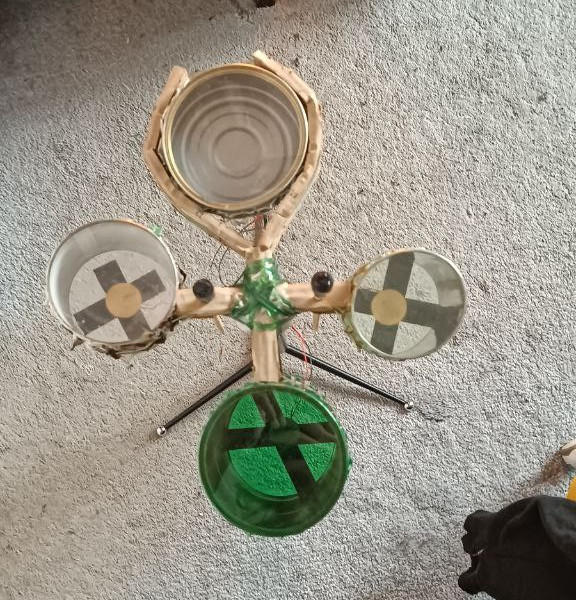
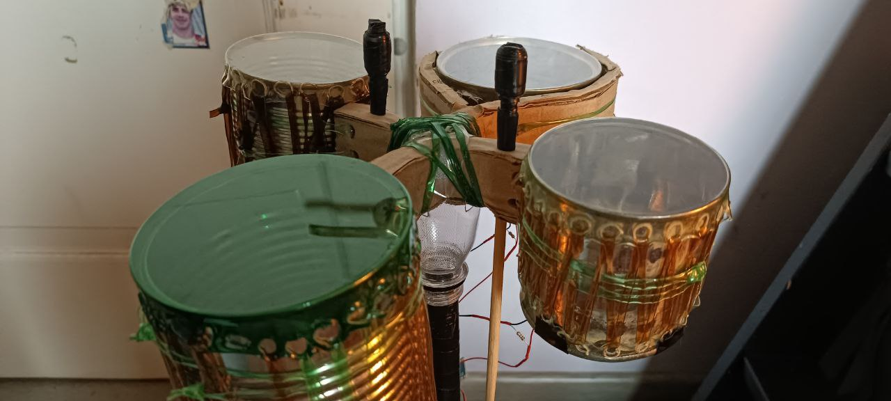
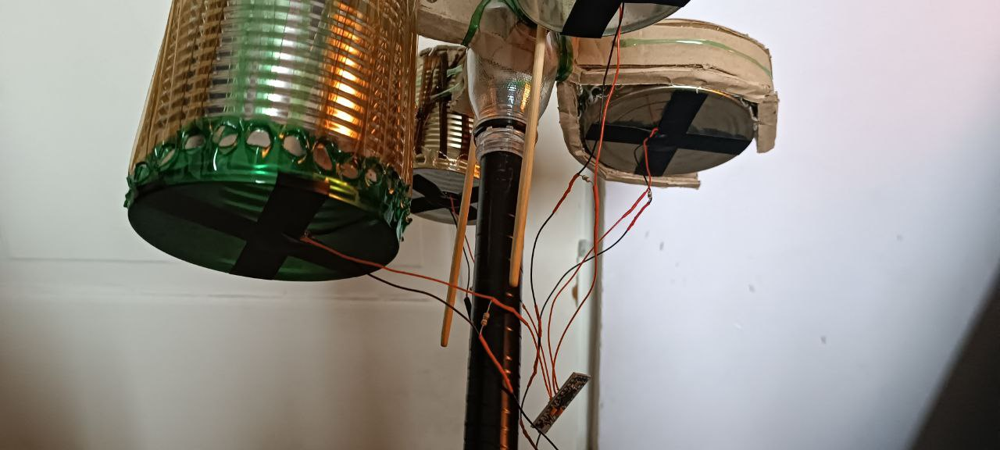

# PATAPADS

Данный проект был создан с целью сделать ощущения от серии игр Patapon более реалистичными

В игре есть четыре барабана:
- PATA
- CHAKA
- PON
- DON

При этом при использовании первых двух барабанов (одно нажатие на клавиатуре/геймпаде и т.д.) в игре происходит "двойной" удар по барабану (PA - TA, CHA - KA).

В результате у меня возникла идея сделать контроллер, который будет регистрировать двойные удары по этим барабанам и выдаввать одно нажатие (если быть точнее, то после первого удара, при отсутствии второго, будет использован другой барабан, котоырй собъёт комбо)

---

Барабаны сделаны из консервных банок, обтянутых пластиковыми бутылками, с прикреплёнными снизу пьезоэлементами

## Фотографии

